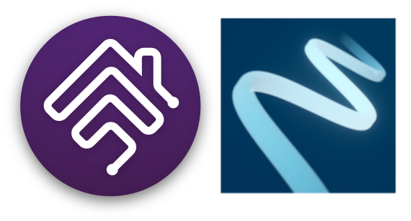

<p align="left">
 
</p>

# homebridge-easee
<br>Easee platform plugin for [Homebridge](https://github.com/nfarina/homebridge).

## About

<br> Supports the ablity to lock and unlock charger from HomeKit
<br> If you have more than one home on your Easee account you may filter devices for a home based on the street address for the location you want to display in HomeKit.

## Notes on testing

This plugin is only been tested with Easee Home Charger.

## Installation
1. Install this plugin using: npm install -g homebridge-easee
3. Use plugin settings to edit ``config.json`` and add your account info.
4. Run Homebridge
5. Pair to HomeKit

## Config.json example with child bridge

```
"platforms": [
	{
    "name": "Easee",
    "username": "user",
    "password": "pass",
		"location_address": "123 Easy St",
		"cars": [
			{
				"carName": "Volvo",
				"chargerName": "Charger 1",
				"kwH": 78
			},
			{
				"carName": "Tesla",
				"chargerName": "Charger 2",
				"kwH": 84
			}
		],
    "showControls": 1,
    "showLight": true,
		"showReboot": false,
		"showOverride": true,
    "_bridge": {
			"username": "0E:46:88:49:71:DD",
			"port": 39306
    },
    "platform": "easee"
	}
]
```
showControls valid values
0:None, 1:Toggle, 2:Start/Stop, 3:Pause/Resume